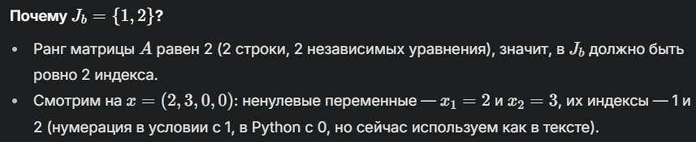

Лабораторная работа посвящена **квадратичному программированию** — это такая штука в математике и программировании, где нужно найти *минимум (или максимум)* какой-то функции, которая зависит от переменных квадратично (то есть там есть члены типа x^2), при этом есть ограничения в виде уравнений и неравенств. Простыми словами, это как оптимизация, но с изюминкой — функция не просто линейная, а посложнее.

**Что такое правильный опорный план?**
Это начальная точка 𝑥, с которой мы стартуем, и она должна удовлетворять всем ограничениям задачи.

**Что нужно сделать?**
Нужно написать программу, которая решает такую задачу методом итераций. На каждой итерации:
1. Проверяем текущий план 𝑥 — оптимальный он или нет.
2. Если нет, делаем шаг в сторону улучшения, обновляем 𝑥 и опоры (𝐽𝑏 и 𝐽𝑏∗).
3. Повторяем, пока не найдём минимум или не поймём, что его нет.
*Цель — дойти до такого 𝑥, где функция минимальна, или понять, что минимума нет.*

**Матрицы и векторы:**
- с — коэффициенты линейной части из нашей целевой функции,
- D — матрица квадратичной части (?),
- A — матрица ограничений (коэфициенты при переменных в наших линейных уравнениях),
- b — правые части линейных уравнений.

- 𝐽𝑏 — это набор индексов переменных, которые "активны" и помогают нам удовлетворять ограничения. Их количество должно быть равно рангу матрицы 
𝐴.
- 𝐽𝑏∗ — это расширенный набор индексов, который включает 𝐽𝑏 и иногда дополнительные индексы, чтобы алгоритм мог двигаться дальше.

**По шагам:**
*ШАГ 1*: Находим векторы 𝑐(𝑥), 𝑢(𝑥), Δ(𝑥). Эти векторы нужны, чтобы понять, в каком состоянии сейчас решение и куда двигаться.
*ШАГ 2*: Проверяем условие оптимальности. Если все компоненты Δ(𝑥)≥0, то текущий план оптимален, и мы закончили.
*ШАГ 3*: Выбираем 𝑗0. Нужно найти индекс, где Δ(𝑥) отрицательно — это направление, в котором мы будем улучшать решение. (мы берем индекс первой отрицательной переменной).
*ШАГ 4*: Находим вектор ℓ — это направление движения, его компоненты делятся на две части, одна для индексов из 𝐽𝑏∗, вторая для остальных индексов.
*ШАГ 5*: Находим 𝜃 — это шаг, на который мы сдвинем 𝑥 вдоль ℓ.
*​ШАГ 6*: Обновляем план и опоры.